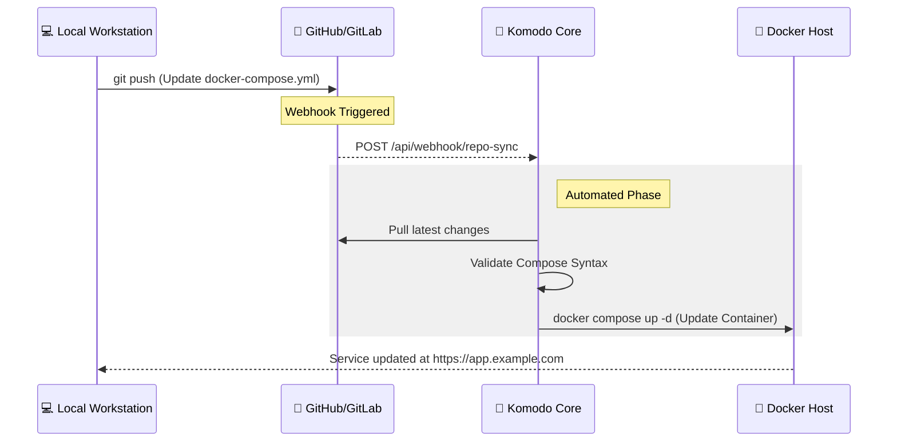

<!--💬GREETINGSTITLE / 🌐WEBSITE: https://github.com/denvercoder1/readme-typing-svg -->
<p align="center">


<!--🖼️SSURFER-->
<p align="center">


<!--📏LINE-->


<h1 align="center">Welcome2👋WESapONE!</h1>

###

<div align="center">
  
  
  
  
  
  
  
  
  
  
  
  
  
  
  
  
  
  
  
</div>

###

<div align="center">
  
  
  
  
  
</div>

###

<div align="center">
  
  
</div>

###

<picture>
    <source media="(prefers-color-scheme: dark)" srcset="https://raw.githubusercontent.com/WESapONE/WESapONE/output/pacman-contribution-graph-dark.svg">
    <source media="(prefers-color-scheme: light)" srcset="https://raw.githubusercontent.com/WESapONE/WESapONE/output/pacman-contribution-graph.svg">
    
</picture>

###


# 🏠 The WesLab

This repository is the **Single Source of Truth** for the WesLab infrastructure. 
Managed by **[Komodo](https://komodo.software)** using a **GitOps** workflow and 
further documentation using rackpeek and netbox.
## 🚀 Architecture Overview
- **Deployment:** [Komodo](https://komodo.software) (Automatic Webhook Deploys)
- **Runtime:** Docker Engine / Proxmox
- **Ingress:** [Traefik Proxy](https://traefik.io) (Automatic SSL via Cloudflare)
- **Auth:** [Authentik](https://goauthentik.io) (Optional)

## 📁 Repository Structure
- `/infrastructure`: Core services (Networking, Monitoring, Backups)
- `/apps`: User-facing services (Media, Productivity)
- `/provisioning`: System-level automation (Ansible/Terraform)
- `/documentation`: Network maps and hardware specs

## 🌐 Network Map
| Service | URL | Deployment Type | Internal IP |
| :--- | :--- | :--- | :--- |
| **Komodo** | `https://komodo.local` | Docker | `192.168.1.5` |
| **Traefik** | `https://traefik.example.com` | Docker | `192.168.1.5` |
| **Proxmox** | `https://pve.example.com` | Bare Metal | `192.168.1.10` |
| **NAS** | `https://nas.example.com` | Bare Metal | `192.168.1.20` |

## 🛠️ Disaster Recovery
### Initial Setup
1. Clone this repo to the Docker host.
2. Create the external network: `docker network create proxy_network`.
3. Set up the `acme.json` permissions: `chmod 600 infrastructure/networking/data/acme.json`.
4. Define secrets in the [Komodo Dashboard](url-to-your-local-komodo).

### Secrets Management
Secrets are **not stored in Git**. 
Reference the `.env.example` file for required variables such as:
- `CF_API_KEY`
- `DOMAIN_NAME`
- `MYSQL_PASSWORD`

## 📊 Maintenance
To update a stack, simply push a change to the `main` branch:
```bash
git add .
git commit -m "feat: add jellyfin stack"
git push origin main

​```mermaid
graph TD
    %% External Traffic
    Internet((Internet)) -->|Port 80/443| Router[ISP Router / Firewall]
    Router -->|Port Forward| Traefik[Traefik Reverse Proxy]

    subgraph "Docker Host (Komodo Managed)"
        Traefik -->|Internal Proxy| Apps[App Stack]
        Apps --> Jellyfin[Jellyfin]
        Apps --> Vaultwarden[Vaultwarden]
        Apps --> Nextcloud[Nextcloud]
    end

    subgraph "External Nodes"
        Traefik -.->|Dynamic Link| PVE[Proxmox VE]
        Traefik -.->|Dynamic Link| NAS[TrueNAS]
    end

    %% Styles
    style Traefik fill:#f96,stroke:#333,stroke-width:2px
    style Internet fill:#85C1E9
    style Router fill:#D5D8DC
```


<!--💬🃏FUNFACT / 🌐https://github.com/siddharth2016/quote-readme#update-your-readme -->
<p align="center">

<b>FUN FACT EVERYDAY🤔 :</b>
<!--STARTS_HERE_QUOTE_README-->
<i>❝ClueBot NG, an AI-powered bot on English Wikipedia, uses machine learning (neural networks and Bayesian classifiers) to analyze edits in real-time, detecting and reverting 40-55% of vandalism with over 90% accuracy—often exceeding 99% accuracy at high confidence thresholds.❞</i>
<!--ENDS_HERE_QUOTE_README-->


<!--📏LINE-->


<!--📊💬STATTITLE / 🌐WEBSITE: https://textanim.com/ -->
<p align="center">


<!--🌯GITHUBTERMINALSTATS💻 / 🌐WEBSITE: https://github.com/yogeshwaran01/github-stats-terminal-style -->
<p align="center">


<!--📊STATSGRAPH / 🌐WEBSITE: https://github.com/anuraghazra/github-readme-stats -->
<p align="center">


<!--📊STREAKSTATSGRAPH / 🌐WEBSITE: https://github.com/denvercoder1/github-readme-streak-stats -->


<!--📙LANGUAGES / 🌐WEBSITE: https://github.com/anuraghazra/github-readme-stats -->
<p align="center">
<a href="https://github.com/WESapONE/AdGuard-WireGuard-Unbound-DNScrypt">


<!--👀VIEWS / 🌐WEBSITE: https://github.com/antonkomarev/github-profile-views-counter -->
<p align="center">


<!--📈ACTIVITYGRAPH / 🌐WEBSITE: https://github.com/Ashutosh00710/github-readme-activity-graph -->


<!--🐍💬SNAKETITLE / 🌐WEBSITE: https://textanim.com/ -->
<p align="center">


<!--🐍📈SNAKEGRAPH / 🌐WEBSITE: https://github.com/Platane/snk & https://github.com/ironmaniiith/Github-profile-name-writer -->


###


###

<!--📉METRICS / 🌐WEBSITE: https://github.com/lowlighter/metrics -->
<h4 align="right">
<details><summary><b>𝓟&nbsp;𝓡&nbsp;𝓞&nbsp;𝓕&nbsp;𝓘&nbsp;𝓛&nbsp;𝓔&nbsp;&nbsp; 𝓜&nbsp;𝓔&nbsp;𝓣&nbsp;𝓡&nbsp;𝓘&nbsp;𝓒&nbsp;𝓢</b></summary>
<p>
<p align="center">

</p>
</details>

<!--📏LINE-->


<!--😂💬JOKETITLE / 🌐WEBSITE: https://textanim.com/ -->
<p align="center">


<!--🤣JOYEMOJI / 🌐WEBSITE: https://github.com/seanprashad/slackmoji/ -->
<p align="center">


<!--😂🃏JOKECARD / 🌐WEBSITE: https://github.com/ABSphreak/readme-jokes -->
<p align="center">


<!--💬QUOTESTITLE / 🌐WEBSITE: https://textanim.com/ -->
<p align="center">


<!--🍷WINEEMOJI / 🌐WEBSITE: https://github.com/seanprashad/slackmoji/ -->
<p align="center">


<!--💬🃏QUOTESCARD / 🌐WEBSITE: https://github.com/PiyushSuthar/github-readme-quotes#Demo & https://github.com/cheehwatang/github-readme-daily-quotes & https://github.com/shravan20/github-readme-quotes -->
<p align="center">

<p align="center">

<p align="center">
<br><br>

<!--💬🃏MEMESTITLE / 🌐WEBSITE: https://textanim.com/ -->
<p align="center">


<!--😻CATEMOJI / 🌐WEBSITE: https://github.com/seanprashad/slackmoji/ -->
<p align="center">


<!--🃏MEMEPHOTOS / 🌐WEBSITE: https://github.com/trinib/Subreddit-Memes -->
<p align="center">


<!--📏LINE-->


<!--💬FUNTITLE / 🌐WEBSITE: https://textanim.com/ -->
<p align="center">


<!--♟️CHESS / 🌐WEBSITE: https://github.com/marcizhu/readme-chess --> 
 <h4 align="center">
<table>
  <tr>
  </tr>
  <tr>
    <td><h5 align="center"><details>
  <summary><h2>&nbsp;Chess Tournament&nbsp;</h2></summary><p>

<h4 align="left">

ANYONE can take a turn on the board  
<i>Make your move !!. It's <!-- BEGIN TURN -->black(solid)<!-- END TURN --> to play(instructions beneath)</i>

<!-- BEGIN CHESS BOARD -->
|   | A | B | C | D | E | F | G | H |   |
|---|:-:|:-:|:-:|:-:|:-:|:-:|:-:|:-:|:-:|
| **8** |  |  |  |  |  |  |  |  | **8** |
| **7** |  |  |  |  |  |  |  |  | **7** |
| **6** |  |  |  |  |  |  |  |  | **6** |
| **5** |  |  |  |  |  |  |  |  | **5** |
| **4** |  |  |  |  |  |  |  |  | **4** |
| **3** |  |  |  |  |  |  |  |  | **3** |
| **2** |  |  |  |  |  |  |  |  | **2** |
| **1** |  |  |  |  |  |  |  |  | **1** |
|   | **A** | **B** | **C** | **D** | **E** | **F** | **G** | **H** |   |
<!-- END CHESS BOARD -->

To move a piece to a postion
 
**_Choose one from the following table_** :
<!-- BEGIN MOVES LIST -->
|  FROM  | TO (Just click a link!) |
| :----: | :---------------------- |
| **E4** | [E3](https://github.com/WESapONEWESapONE/issues/new?body=Please+do+not+change+the+title.+Just+click+%22Submit+new+issue%22.+You+don%27t+need+to+do+anything+else+%3AD&title=Chess%3A+Move+E4+to+E3) |
| **E7** | [C8](https://github.com/WESapONEWESapONE/issues/new?body=Please+do+not+change+the+title.+Just+click+%22Submit+new+issue%22.+You+don%27t+need+to+do+anything+else+%3AD&title=Chess%3A+Move+E7+to+C8), [D5](https://github.com/WESapONEWESapONE/issues/new?body=Please+do+not+change+the+title.+Just+click+%22Submit+new+issue%22.+You+don%27t+need+to+do+anything+else+%3AD&title=Chess%3A+Move+E7+to+D5), [F5](https://github.com/WESapONEWESapONE/issues/new?body=Please+do+not+change+the+title.+Just+click+%22Submit+new+issue%22.+You+don%27t+need+to+do+anything+else+%3AD&title=Chess%3A+Move+E7+to+F5), [G6](https://github.com/WESapONEWESapONE/issues/new?body=Please+do+not+change+the+title.+Just+click+%22Submit+new+issue%22.+You+don%27t+need+to+do+anything+else+%3AD&title=Chess%3A+Move+E7+to+G6), [G8](https://github.com/WESapONEWESapONE/issues/new?body=Please+do+not+change+the+title.+Just+click+%22Submit+new+issue%22.+You+don%27t+need+to+do+anything+else+%3AD&title=Chess%3A+Move+E7+to+G8) |
| **E8** | [D7](https://github.com/WESapONEWESapONE/issues/new?body=Please+do+not+change+the+title.+Just+click+%22Submit+new+issue%22.+You+don%27t+need+to+do+anything+else+%3AD&title=Chess%3A+Move+E8+to+D7), [D8](https://github.com/WESapONEWESapONE/issues/new?body=Please+do+not+change+the+title.+Just+click+%22Submit+new+issue%22.+You+don%27t+need+to+do+anything+else+%3AD&title=Chess%3A+Move+E8+to+D8), [F7](https://github.com/WESapONEWESapONE/issues/new?body=Please+do+not+change+the+title.+Just+click+%22Submit+new+issue%22.+You+don%27t+need+to+do+anything+else+%3AD&title=Chess%3A+Move+E8+to+F7) |
| **F6** | [F5](https://github.com/WESapONEWESapONE/issues/new?body=Please+do+not+change+the+title.+Just+click+%22Submit+new+issue%22.+You+don%27t+need+to+do+anything+else+%3AD&title=Chess%3A+Move+F6+to+F5) |
| **G4** | [F4](https://github.com/WESapONEWESapONE/issues/new?body=Please+do+not+change+the+title.+Just+click+%22Submit+new+issue%22.+You+don%27t+need+to+do+anything+else+%3AD&title=Chess%3A+Move+G4+to+F4), [G1](https://github.com/WESapONEWESapONE/issues/new?body=Please+do+not+change+the+title.+Just+click+%22Submit+new+issue%22.+You+don%27t+need+to+do+anything+else+%3AD&title=Chess%3A+Move+G4+to+G1), [G2](https://github.com/WESapONEWESapONE/issues/new?body=Please+do+not+change+the+title.+Just+click+%22Submit+new+issue%22.+You+don%27t+need+to+do+anything+else+%3AD&title=Chess%3A+Move+G4+to+G2), [G3](https://github.com/WESapONEWESapONE/issues/new?body=Please+do+not+change+the+title.+Just+click+%22Submit+new+issue%22.+You+don%27t+need+to+do+anything+else+%3AD&title=Chess%3A+Move+G4+to+G3), [G5](https://github.com/WESapONEWESapONE/issues/new?body=Please+do+not+change+the+title.+Just+click+%22Submit+new+issue%22.+You+don%27t+need+to+do+anything+else+%3AD&title=Chess%3A+Move+G4+to+G5), [G6](https://github.com/WESapONEWESapONE/issues/new?body=Please+do+not+change+the+title.+Just+click+%22Submit+new+issue%22.+You+don%27t+need+to+do+anything+else+%3AD&title=Chess%3A+Move+G4+to+G6), [G7](https://github.com/WESapONEWESapONE/issues/new?body=Please+do+not+change+the+title.+Just+click+%22Submit+new+issue%22.+You+don%27t+need+to+do+anything+else+%3AD&title=Chess%3A+Move+G4+to+G7), [G8](https://github.com/WESapONEWESapONE/issues/new?body=Please+do+not+change+the+title.+Just+click+%22Submit+new+issue%22.+You+don%27t+need+to+do+anything+else+%3AD&title=Chess%3A+Move+G4+to+G8), [H4](https://github.com/WESapONEWESapONE/issues/new?body=Please+do+not+change+the+title.+Just+click+%22Submit+new+issue%22.+You+don%27t+need+to+do+anything+else+%3AD&title=Chess%3A+Move+G4+to+H4) |
<!-- END MOVES LIST -->

Having fun? Ask a friend to play next move to get the next turn !

<details>
  <summary>How it works</summary>
When you click on a link it will submit a new issue with the desired move, create the issue and a GitHub action is triggered, which in turn runs a small python script that performs the specified movement, updates this README file and commits the changes.
</details>


<details>
  <summary>Last 5 moves in this game</summary>
<!-- BEGIN LAST MOVES -->

| Move | Author |
| :--: | :----- |
| `H2` to `H3` | [ @StackOverflowIsBetterThanAnyAI](https://github.com/StackOverflowIsBetterThanAnyAI) |
| `G8` to `G4` | [ @Odinwattez](https://github.com/Odinwattez) |
| `D1` to `E1` | [ @StackOverflowIsBetterThanAnyAI](https://github.com/StackOverflowIsBetterThanAnyAI) |
| `H8` to `G8` | [ @benFrnklnDuck](https://github.com/benFrnklnDuck) |
| `E3` to `H6` | [ @StackOverflowIsBetterThanAnyAI](https://github.com/StackOverflowIsBetterThanAnyAI) |

<!-- END LAST MOVES -->
</details>

<details>
  <summary>Top 10 most moves across all games</summary>
<!-- BEGIN TOP MOVES -->

| Total moves |  User  |
| :---------: | :----- |
| 26 | [@WESapONE](https://github.com/WESapONE) |
| 14 | [@JayantGoel001](https://github.com/JayantGoel001) |
| 8 | [@viktoriussuwandi](https://github.com/viktoriussuwandi) |
| 6 | [@StackOverflowIsBetterThanAnyAI](https://github.com/StackOverflowIsBetterThanAnyAI) |
| 5 | [@lulunac27a](https://github.com/lulunac27a) |
| 3 | [@Sabyasachi-Seal](https://github.com/Sabyasachi-Seal) |
| 3 | [@harshendram](https://github.com/harshendram) |
| 2 | [@Basvdlouw](https://github.com/Basvdlouw) |
| 2 | [@TomfromBerlin](https://github.com/TomfromBerlin) |
| 2 | [@SagXD](https://github.com/SagXD) |

<!-- END TOP MOVES -->

</details>
</details><h5 align="center">
  </tr>
 </table>
      
<!--CONNECTDOT🔴🟡 / 🌐WEBSITE: https://github.com/bloedboemmel/bloedboemmel --> 
 <h4 align="center">
<table>
  <tr>
  </tr>
  <tr>
    <td><h5 align="center"><details>
  <summary><h2>&nbsp;&nbsp;&nbsp;Connect 4 Dots&nbsp;&nbsp;&nbsp;</h2></summary><p>

<h4 align="left">

Here you can play Connect4. Just click a number under the grid to move. It's <!-- BEGIN TURN2 -->red<!-- END TURN2 --> turn.

<!-- BEGIN CONNECT4 BOARD -->
|   | 1 | 2 | 3 | 4 | 5 | 6 | 7 |   |
|---|:-:|:-:|:-:|:-:|:-:|:-:|:-:|:-:|
|---| |  |  |  |  |  |  | |---|
|---| |  |  |  |  |  |  | |---|
|---| |  |  |  |  |  |  | |---|
|---| |  |  |  |  |  |  | |---|
|---| |  |  |  |  |  |  | |---|
|---| |  |  |  |  |  |  | |---|
|   | [1](https://github.com/WESapONE/WESapONE/issues/new?body=Please+do+not+change+the+title.+Just+click+%22Submit+new+issue%22.+You+don%27t+need+to+do+anything+else+%3AD&title=Connect4%3A+Put+1) | [2](https://github.com/WESapONE/WESapONE/issues/new?body=Please+do+not+change+the+title.+Just+click+%22Submit+new+issue%22.+You+don%27t+need+to+do+anything+else+%3AD&title=Connect4%3A+Put+2) | [3](https://github.com/WESapONE/WESapONE/issues/new?body=Please+do+not+change+the+title.+Just+click+%22Submit+new+issue%22.+You+don%27t+need+to+do+anything+else+%3AD&title=Connect4%3A+Put+3) | [4](https://github.com/WESapONE/WESapONE/issues/new?body=Please+do+not+change+the+title.+Just+click+%22Submit+new+issue%22.+You+don%27t+need+to+do+anything+else+%3AD&title=Connect4%3A+Put+4) | [5](https://github.com/WESapONE/WESapONE/issues/new?body=Please+do+not+change+the+title.+Just+click+%22Submit+new+issue%22.+You+don%27t+need+to+do+anything+else+%3AD&title=Connect4%3A+Put+5) | [6](https://github.com/WESapONE/WESapONE/issues/new?body=Please+do+not+change+the+title.+Just+click+%22Submit+new+issue%22.+You+don%27t+need+to+do+anything+else+%3AD&title=Connect4%3A+Put+6) | [7](https://github.com/WESapONE/WESapONE/issues/new?body=Please+do+not+change+the+title.+Just+click+%22Submit+new+issue%22.+You+don%27t+need+to+do+anything+else+%3AD&title=Connect4%3A+Put+7) |   |
<!-- END CONNECT4 BOARD -->
<!-- BEGIN MOVES LIST2 -->
<!-- END MOVES LIST2 -->

<details>
  <summary>Last 5 moves in this game</summary>
<!-- BEGIN LAST MOVES2 -->

| Move | Author |
| :--: | :----- |
| `4` |  [ @harshendram](https://github.com/harshendram) | |
| `2` |  [ @StackOverflowIsBetterThanAnyAI](https://github.com/StackOverflowIsBetterThanAnyAI) | |
| `5` |  [ @StackOverflowIsBetterThanAnyAI](https://github.com/StackOverflowIsBetterThanAnyAI) | |
| `5` |  [ @StackOverflowIsBetterThanAnyAI](https://github.com/StackOverflowIsBetterThanAnyAI) | |
| `6` |  [ @StackOverflowIsBetterThanAnyAI](https://github.com/StackOverflowIsBetterThanAnyAI) | |

<!-- END LAST MOVES2 -->
</details>

<details>
  <summary>Top 10 most moves across all games</summary>
<!-- BEGIN TOP MOVES2 -->

| Total moves |  User  |
| :---------: | :----- |
| 35 |  [@StackOverflowIsBetterThanAnyAI](https://github.com/StackOverflowIsBetterThanAnyAI) | |
| 12 |  [@WESapONE](https://github.com/WESapONE) | |
| 9 |  [@viktoriussuwandi](https://github.com/viktoriussuwandi) | |
| 6 |  [@lulunac27a](https://github.com/lulunac27a) | |
| 5 |  [@oxoovo](https://github.com/oxoovo) | |
| 4 |  [@benzlokzik](https://github.com/benzlokzik) | |
| 3 |  [@jhoitenga](https://github.com/jhoitenga) | |
| 2 |  [@JayantGoel001](https://github.com/JayantGoel001) | |
| 2 |  [@mauro-balades](https://github.com/mauro-balades) | |
| 2 |  [@Cophhy](https://github.com/Cophhy) | |

<!-- END TOP MOVES2 -->
</details>
</details>
</details><h5 align="center">
  </tr>
 </table>
      
#
<!--✏️WORDBOARD / 🌐WEBSITE: https://github.com/JessicaLim8/JessicaLim8 --> 
<h2 align="center">
Join the Word Cloud Board :cloud: :pencil2:

### :thought_balloon: <a href="https://github.com/WESapONE/word-cloud/issues/new?template=addword.md&title=wordcloud%7Cadd%7C%3CINSERT-WORD%3E"><b>Add your name</b></a> to see the word cloud update in real time :rocket:

:star2: Don't like the arrangement? <a href="https://github.com/WESapONE/word-cloud/issues/new?template=shufflecloud.md&title=wordcloud%7Cshuffle"><b>Regenerate it</b></a> :game_die:

<h3 align="center">
📛Github Usernames📛 
</br> 


<!--📏LINE-->

<p align="center">

<!--🐱CAT-->
<p align="center">


<!--🤔INTERESTTITLE-->
<p align="center">


<!--🖼️🖼️INTERSTLOGOS-->
<p align="center">


</h4>

<!--🖼️⭐🔱STARRED/FORK-->
<h4 align="right">
 
<table>
  <tr>
   
   &nbsp;&nbsp;&nbsp;&nbsp;&nbsp;&nbsp;&nbsp;&nbsp;&nbsp;&nbsp;&nbsp;&nbsp;&nbsp;&nbsp;&nbsp;&nbsp;&nbsp;&nbsp;&nbsp;
   &nbsp;&nbsp;&nbsp;&nbsp;&nbsp;&nbsp;&nbsp;&nbsp;&nbsp;&nbsp;&nbsp;&nbsp;&nbsp;&nbsp;
  </tr>
  <tr>
    <td><p align="center"><a href="https://github.com/WESapONE?tab=stars"><b>MY STARRED REPOS <br>AND TOPICS</b></a>
    <td><p align="center"><a href="https://github.com/WESapONE/WESapONE/edit/main/README.md"><b>FORK PROFILE WITH <br>EASY EDITING</b></a>
  </tr>
 </table>
 
<!--📏LINE-->
<p align="center">


<!--🎨THEMEMODE / 🌐WEBSITE: https://fancytext.blogspot.com/ -->
<h4 align="left">
</h4>
 
╔═&nbsp;&nbsp;👀 𝕐&nbsp;𝕆&nbsp;𝕌&nbsp;ℝ&nbsp;&nbsp;𝕋&nbsp;ℍ&nbsp;𝔼&nbsp;𝕄&nbsp;𝔼&nbsp;&nbsp;𝕄&nbsp;𝕆&nbsp;𝔻&nbsp;𝔼 👀
<h4>
<h4 align="left">  
 
╚═════ &nbsp;𝐈𝐓'𝐒 [𝐃𝐀𝐑𝐊⚫](https://github.com/settings/appearance#gh-dark-mode-only)[𝐁𝐑𝐈𝐆𝐇𝐓⚪](https://github.com/settings/appearance#gh-light-mode-only) 𝐈𝐍 𝐇𝐄𝐑𝐄...
<h4>

<!--🪳ROACH&🕷️SPIDER--> 
<p align="left">
&nbsp;&nbsp;&nbsp;&nbsp;&nbsp;&nbsp;&nbsp;&nbsp;&nbsp;&nbsp;&nbsp;&nbsp;&nbsp;&nbsp;&nbsp;&nbsp;&nbsp;&nbsp;&nbsp;&nbsp;&nbsp;&nbsp;&nbsp;&nbsp;&nbsp;&nbsp;&nbsp;&nbsp;&nbsp;&nbsp;&nbsp;&nbsp;&nbsp;&nbsp;&nbsp;&nbsp;&nbsp;&nbsp;&nbsp;&nbsp;&nbsp;&nbsp;&nbsp;&nbsp;&nbsp;&nbsp;&nbsp;&nbsp;&nbsp;&nbsp;&nbsp;&nbsp;&nbsp;&nbsp;&nbsp;&nbsp;&nbsp;&nbsp;&nbsp;&nbsp;&nbsp;&nbsp;&nbsp;&nbsp;&nbsp;&nbsp;&nbsp;&nbsp;&nbsp;&nbsp;&nbsp;&nbsp;&nbsp;&nbsp;&nbsp;&nbsp;&nbsp;&nbsp;&nbsp;&nbsp;&nbsp;&nbsp;&nbsp;&nbsp;&nbsp;&nbsp;&nbsp;&nbsp;&nbsp;&nbsp;&nbsp;&nbsp;&nbsp;&nbsp;&nbsp;&nbsp;&nbsp;&nbsp;&nbsp;&nbsp;&nbsp;&nbsp;&nbsp;&nbsp;&nbsp;&nbsp;&nbsp;&nbsp;&nbsp;&nbsp;&nbsp;&nbsp;
 
<!--🦶FOOTER--> 


<!--⚽️ACTIVITY / 🌐WEBSITE: https://github.com/Readme-Workflows/recent-activity -->
<!--RECENT_ACTIVITY:start-->
<!--RECENT_ACTIVITY:end-->
<p align="right">
<!--RECENT_ACTIVITY:last_update-->
<i>Last refresh</i> : <b>Thursday, October 9th, 2025, 11:26:28 AM</b>
<!--RECENT_ACTIVITY:last_update_end-->


<a href="https://github.com/WESapONE/WESapONE/graphs/contributors">
  
</a>

<!-- 

<!--🖼️ILOVEOPENSOURCE-->


𝐈𝐅 𝐘𝐎𝐔 𝐑𝐄𝐀𝐂𝐇𝐄𝐃 𝐇𝐄𝐑𝐄 (C O N G R A T S 🎉🎈🎊) 

𝐂𝐇𝐄𝐂𝐊 𝐎𝐔𝐓 𝐓𝐇𝐄𝐒𝐄:


██████╗ ███████╗ █████╗ ██╗   ██╗████████╗██╗███████╗██╗   ██╗     ██████╗ ██╗████████╗██╗  ██╗██╗   ██╗██████╗ 
██╔══██╗██╔════╝██╔══██╗██║   ██║╚══██╔══╝██║██╔════╝╚██╗ ██╔╝    ██╔════╝ ██║╚══██╔══╝██║  ██║██║   ██║██╔══██╗
██████╔╝█████╗  ███████║██║   ██║   ██║   ██║█████╗   ╚████╔╝     ██║  ███╗██║   ██║   ███████║██║   ██║██████╔╝
██╔══██╗██╔══╝  ██╔══██║██║   ██║   ██║   ██║██╔══╝    ╚██╔╝      ██║   ██║██║   ██║   ██╔══██║██║   ██║██╔══██╗
██████╔╝███████╗██║  ██║╚██████╔╝   ██║   ██║██║        ██║       ╚██████╔╝██║   ██║   ██║  ██║╚██████╔╝██████╔╝
╚═════╝ ╚══════╝╚═╝  ╚═╝ ╚═════╝    ╚═╝   ╚═╝╚═╝        ╚═╝        ╚═════╝ ╚═╝   ╚═╝   ╚═╝  ╚═╝ ╚═════╝ ╚═════╝                                         
https://github.com/rzashakeri/beautify-github-profile


 ██████╗ ██╗████████╗██╗  ██╗██╗   ██╗██████╗     ███████╗███████╗ █████╗ ██████╗  ██████╗██╗  ██╗
██╔════╝ ██║╚══██╔══╝██║  ██║██║   ██║██╔══██╗    ██╔════╝██╔════╝██╔══██╗██╔══██╗██╔════╝██║  ██║
██║  ███╗██║   ██║   ███████║██║   ██║██████╔╝    ███████╗█████╗  ███████║██████╔╝██║     ███████║
██║   ██║██║   ██║   ██╔══██║██║   ██║██╔══██╗    ╚════██║██╔══╝  ██╔══██║██╔══██╗██║     ██╔══██║
╚██████╔╝██║   ██║   ██║  ██║╚██████╔╝██████╔╝    ███████║███████╗██║  ██║██║  ██║╚██████╗██║  ██║
 ╚═════╝ ╚═╝   ╚═╝   ╚═╝  ╚═╝ ╚═════╝ ╚═════╝     ╚══════╝╚══════╝╚═╝  ╚═╝╚═╝  ╚═╝ ╚═════╝╚═╝  ╚═╝
https://github.com/gennaro-tedesco/gh-s


███████╗██╗   ██╗███╗   ██╗ ██████╗    ███████╗ ██████╗ ██████╗ ██╗  ██╗███████╗
██╔════╝╚██╗ ██╔╝████╗  ██║██╔════╝    ██╔════╝██╔═══██╗██╔══██╗██║ ██╔╝██╔════╝
███████╗ ╚████╔╝ ██╔██╗ ██║██║         █████╗  ██║   ██║██████╔╝█████╔╝ ███████╗
╚════██║  ╚██╔╝  ██║╚██╗██║██║         ██╔══╝  ██║   ██║██╔══██╗██╔═██╗ ╚════██║
███████║   ██║   ██║ ╚████║╚██████╗    ██║     ╚██████╔╝██║  ██║██║  ██╗███████║
╚══════╝   ╚═╝   ╚═╝  ╚═══╝ ╚═════╝    ╚═╝      ╚═════╝ ╚═╝  ╚═╝╚═╝  ╚═╝╚══════╝
https://github.com/wei/pull

██████╗ ███████╗███████╗██╗███╗   ██╗███████╗██████╗        ██████╗ ██╗████████╗██╗  ██╗██╗   ██╗██████╗ 
██╔══██╗██╔════╝██╔════╝██║████╗  ██║██╔════╝██╔══██╗      ██╔════╝ ██║╚══██╔══╝██║  ██║██║   ██║██╔══██╗
██████╔╝█████╗  █████╗  ██║██╔██╗ ██║█████╗  ██║  ██║█████╗██║  ███╗██║   ██║   ███████║██║   ██║██████╔╝
██╔══██╗██╔══╝  ██╔══╝  ██║██║╚██╗██║██╔══╝  ██║  ██║╚════╝██║   ██║██║   ██║   ██╔══██║██║   ██║██╔══██╗
██║  ██║███████╗██║     ██║██║ ╚████║███████╗██████╔╝      ╚██████╔╝██║   ██║   ██║  ██║╚██████╔╝██████╔╝
╚═╝  ╚═╝╚══════╝╚═╝     ╚═╝╚═╝  ╚═══╝╚══════╝╚═════╝        ╚═════╝ ╚═╝   ╚═╝   ╚═╝  ╚═╝ ╚═════╝ ╚═════╝ 
https://github.com/refined-github/refined-github

-->                                                                                                        

<!--
**WESapONE/WESapONE** is a ✨ _special_ ✨ repository because its `README.md` (this file) appears on your GitHub profile.

Here are some ideas to get you started:

- 🔭 I’m currently working on ...
- 🌱 I’m currently learning ...
- 👯 I’m looking to collaborate on ...
- 🤔 I’m looking for help with ...
- 💬 Ask me about ...
- 📫 How to reach me: ...
- 😄 Pronouns: ...
- ⚡ Fun fact: ...
-->
